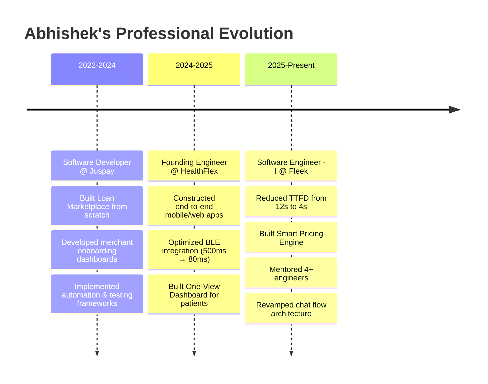

<div align="center">

<!-- Animated Holographic Header -->


<!-- Animated Name with Glitch Effect -->
<div align="center">

</div>

<!-- Animated Role Description -->
<div align="center">

</div>

<!-- Dynamic Role Carousel -->
<div align="center">

</div>

<!-- Futuristic Badges with Glow Effect -->
<p align="center">
  
  
  
  
</p>

<!-- Animated Profile Views Counter -->
<p align="center">
  
  
  
  
</p>

</div>

---

<!-- Matrix-style Animated Divider -->
<div align="center">
  
</div>

##  **NEURAL NETWORK PROFILE ANALYSIS**

<table width="100%">
<tr>
<td width="50%" valign="top">

###  **SYSTEM DIAGNOSTICS**

```typescript
interface DeveloperProfile {
  name: "Abhishek Jaiswal";
  role: "Software Engineer - I @ Fleek";
  location: "Bangalore, India 🇮🇳";
  
  superpowers: {
    performance: "12s → 4s optimization ⚡";
    mentorship: "4+ engineers guided 🎯";
    architecture: "Scalable systems 🏗️";
    innovation: "Smart pricing engine 💰";
  };
  
  currentMission: "Building the future, one commit at a time";
  funFact: "I speak fluent JavaScript, TypeScript & Binary 🤖";
}
```

</td>
<td width="50%" valign="top">

###  **REAL-TIME ACTIVITY**

<div align="center">

<!-- Animated Coding GIF -->


**⚡ Currently crafting:** Advanced React Native optimizations  
**🧠 Learning:** AI/ML integration patterns  
**🎯 Next project:** SaaS automation platform  
**💬 Ask me about:** Performance optimization & scaling

</div>

</td>
</tr>
</table>

---

##  **TECHNOLOGY ARSENAL**

<div align="center">

<!-- 3D Tech Stack Visualization -->
<table>
<tr>
<td align="center" width="20%">

<br><strong>React</strong>
<br>
</td>
<td align="center" width="20%">

<br><strong>TypeScript</strong>
<br>
</td>
<td align="center" width="20%">

<br><strong>JavaScript</strong>
<br>
</td>
<td align="center" width="20%">

<br><strong>Node.js</strong>
<br>
</td>
<td align="center" width="20%">

<br><strong>GraphQL</strong>
<br>
</td>
</tr>
</table>

<!-- Animated Tech Tags Cloud -->
<p align="center">
  
</p>

<!-- Matrix-style Skills Display -->
<details>
<summary><b>🔮 EXPAND TECH MATRIX</b></summary>

```javascript
const techStack = {
  frontend: {
    frameworks: ['React', 'React Native', 'Next.js', 'Remix.js'],
    languages: ['TypeScript', 'JavaScript', 'HTML5', 'CSS3'],
    stateManagement: ['Redux', 'Zustand', 'React Query', 'RxJS'],
    styling: ['TailwindCSS', 'Material-UI', 'Styled Components', 'Bootstrap'],
    performance: ['Lazy Loading', 'Code Splitting', 'Bundle Optimization']
  },
  
  backend: {
    runtime: ['Node.js', 'Express.js'],
    databases: ['MongoDB', 'MySQL', 'PostgreSQL', 'Firebase'],
    apis: ['RESTful', 'GraphQL', 'Socket.IO'],
    cloud: ['AWS Lambda', 'EC2', 'Heroku'],
    testing: ['Jest', 'Postman']
  },
  
  mobile: {
    platforms: ['React Native', 'Cross-platform'],
    features: ['BLE Integration', 'Offline Storage', 'Push Notifications'],
    optimization: ['Performance Tuning', 'Memory Management', 'Render Optimization']
  },
  
  tools: {
    development: ['VS Code', 'Cursor', 'Git', 'Figma MCP'],
    aiTools: ['Background Agents', 'Context Engineering', 'Prompt Engineering'],
    deployment: ['CI/CD', 'Docker', 'Kubernetes']
  }
};

console.log('🚀 Ready to build the future!');
```

</details>

</div>

---

##  **PROFESSIONAL JOURNEY TIMELINE**

<div align="center">



</div>

<!-- Interactive Achievement Cards -->
<div align="center">

###  **ACHIEVEMENT UNLOCKED**

<table>
<tr>
<td align="center" width="25%">
<br>
<sub><b>12s → 4s TTFD Optimization</b></sub>
</td>
<td align="center" width="25%">
<br>
<sub><b>Guided 4+ Engineers</b></sub>
</td>
<td align="center" width="25%">
<br>
<sub><b>Scalable System Design</b></sub>
</td>
<td align="center" width="25%">
<br>
<sub><b>Smart Pricing Engine</b></sub>
</td>
</tr>
</table>

</div>

---

##  **PROJECT SHOWCASE GALLERY**

<div align="center">

<!-- 3D Project Cards -->
<table>
<tr>
<td width="50%">

###  **DesiDine - Smart Food Ordering**

<div align="center">


</div>

```diff
+ ⚡ Swiggy API Integration
+ 🚀 Advanced Redux State Management  
+ 📱 Responsive PWA Design
+ 🔥 Lazy Loading & Optimization
+ 💨 Lightning Fast Performance
```

<div align="center">
<a href="#"></a>
<a href="#"></a>
</div>

</td>
<td width="50%">

###  **WeatherApp - AI Weather Prediction**

<div align="center">


</div>

```diff
+ 🌍 Geolocation Integration
+ 🤖 AI-Powered Predictions
+ 📊 Interactive Weather Charts
+ 🌈 Beautiful UI/UX Design
+ 📱 Cross-Platform Support
```

<div align="center">
<a href="#"></a>
<a href="#"></a>
</div>

</td>
</tr>
<tr>
<td width="50%">

###  **ChatApp - Real-time Communication Hub**

<div align="center">


</div>

```diff
+ 💬 Real-time Messaging
+ 👥 Multi-user Support
+ 🔐 End-to-End Encryption
+ 🌐 Cross-Platform Sync
+ 🚀 Scalable Architecture
```

<div align="center">
<a href="#"></a>
</div>

</td>
<td width="50%">

###  **Next-Gen Projects Loading...**

<div align="center">


</div>

```diff
+ 🤖 AI-Powered SaaS Platform
+ 🔮 Blockchain Integration
+ 🌐 IoT Device Management
+ 🚀 Microservices Architecture
+ ⚡ Real-time Analytics
```

<div align="center">

</div>

</td>
</tr>
</table>

</div>

---

##  **NEURAL NETWORK ANALYTICS**

<div align="center">

<!-- Advanced GitHub Stats with Animations -->


<!-- Language Usage with Futuristic Design -->


<!-- 3D Contribution Graph -->


<!-- Achievement Showcase -->


</div>

---

##  **PERFORMANCE METRICS DASHBOARD**

<div align="center">

<!-- Real-time Performance Indicators -->
<table>
<tr>
<td align="center" width="20%">
<br>
<sub><b>300% Faster Load Time</b></sub>
</td>
<td align="center" width="20%">
<br>
<sub><b>84% Performance Boost</b></sub>
</td>
<td align="center" width="20%">
<br>
<sub><b>Scale Achievement</b></sub>
</td>
<td align="center" width="20%">
<br>
<sub><b>Clean Architecture</b></sub>
</td>
<td align="center" width="20%">
<br>
<sub><b>Efficiency Master</b></sub>
</td>
</tr>
</table>

<!-- Holographic Skill Levels -->
###  **SKILL MATRIX VISUALIZATION**

```typescript
class SkillMatrix {
  private skills = {
    "Frontend Mastery": "████████████████████ 95%",
    "Backend Wizardry": "███████████████████░ 90%", 
    "Mobile Sorcery": "████████████████████ 95%",
    "Database Alchemy": "██████████████████░░ 85%",
    "Cloud Architecture": "████████████████░░░░ 80%",
    "DevOps Magic": "███████████████░░░░░ 75%",
    "AI Integration": "██████████████░░░░░░ 70%",
    "Mentoring Power": "████████████████████ 100%"
  };
  
  displayMatrix() {
    console.log("🚀 Skill Assessment Complete!");
    return this.skills;
  }
}
```

</div>

---

##  **MISSION CONTROL CENTER**

<div align="center">

<!-- Current Status Dashboard -->
<table>
<tr>
<td align="center" width="33%">

###  **CURRENT MISSION**
```json
{
  "status": "🟢 ACTIVE",
  "project": "Smart Pricing Engine",
  "progress": "85%",
  "eta": "Q2 2025",
  "team_size": "4 engineers"
}
```

</td>
<td align="center" width="33%">

###  **LEARNING PIPELINE**
```json
{
  "current": "AI/ML Integration",
  "next": "System Design Patterns",
  "priority": "Cloud Native Architecture",
  "status": "📚 STUDYING"
}
```

</td>
<td align="center" width="33%">

###  **2025 OBJECTIVES**
```json
{
  "goal_1": "🎯 Master System Design",
  "goal_2": "🌟 Open Source Contributions", 
  "goal_3": "🚀 Launch SaaS Product",
  "goal_4": "👨‍🏫 Tech Community Leader"
}
```

</td>
</tr>
</table>

</div>

---

##  **QUANTUM COMMUNICATION PROTOCOLS**

<div align="center">

<!-- Futuristic Contact Section -->


###  **ESTABLISH CONNECTION**

<table>
<tr>
<td align="center" width="20%">
<a href="mailto:iam001abhi@gmail.com">

</a><br><sub><b>iam001abhi@gmail.com</b></sub>
</td>
<td align="center" width="20%">
<a href="https://linkedin.com/in/abhishek-jaiswal">

</a><br><sub><b>Professional Network</b></sub>
</td>
<td align="center" width="20%">
<a href="https://leetcode.com/your-profile">

</a><br><sub><b>Problem Solving Hub</b></sub>
</td>
<td align="center" width="20%">
<a href="https://github.com/abhiedward001">

</a><br><sub><b>Source Code Universe</b></sub>
</td>
<td align="center" width="20%">
<a href="tel:+917388552907">

</a><br><sub><b>+91-7388552907</b></sub>
</td>
</tr>
</table>

<!-- Holographic Quote -->
<div align="center">

</div>

</div>

---

<!-- Spectacular Footer Animation -->
<div align="center">


<!-- Matrix Digital Rain Effect -->


<br>

<!-- Social Links Footer -->
<table>
<tr>
<td align="center">
<a href="mailto:iam001abhi@gmail.com">

</a>
</td>
<td align="center">
<a href="https://linkedin.com/in/abhishek-jaiswal">

</a>
</td>
<td align="center">
<a href="https://github.com/abhiedward001">

</a>
</td>
<td align="center">
<a href="tel:+917388552907">

</a>
</td>
</tr>
</table>

<br>

<!-- Final Message -->


<br><br>

<!-- Copyright with style -->
<div align="center">

<br>
<sub><b>© 2025 Abhishek Jaiswal | Full Stack Architect | Performance Engineer</b></sub>
</div>

<!-- Visitor Counter -->


</div>
